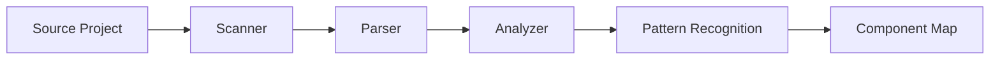
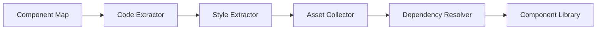

# Component Extraction Guide

## Overview

The extraction process analyzes source projects to identify reusable components, design patterns, and visual styles. This guide covers the extraction pipeline, configuration options, and best practices.

## Extraction Pipeline

### Phase 1: Analysis



### Phase 2: Extraction



## Running Extraction

### Basic Commands

```bash
# Extract from all sources
npm run extract:all

# Extract from specific source
npm run extract --source=project-1

# Extract specific types
npm run extract --source=project-1 --only=components
npm run extract --source=project-1 --only=styles
npm run extract --source=project-1 --only=patterns
```

### Advanced Options

```bash
npm run extract \
  --source=project-1 \
  --components=true \
  --styles=true \
  --assets=true \
  --patterns=true \
  --depth=3 \
  --minUsage=2 \
  --output=./library
```

## Component Detection

### Automatic Detection

The system automatically identifies components based on:

1. **File Structure**
   - Component directories
   - File naming patterns
   - Module exports

2. **Code Patterns**
   ```javascript
   // React Components
   export default function Button() {}
   export const Card = () => {}
   
   // Vue Components
   export default defineComponent({})
   
   // Web Components
   class MyElement extends HTMLElement {}
   ```

3. **Usage Frequency**
   - Components used multiple times
   - Shared across pages
   - Imported by other components

### Manual Configuration

```json
{
  "extraction": {
    "components": {
      "patterns": [
        "src/components/**/*.{jsx,tsx}",
        "components/**/*.vue"
      ],
      "ignore": [
        "**/*.test.*",
        "**/*.spec.*",
        "**/stories/*"
      ],
      "minUsage": 2,
      "extractProps": true,
      "extractTypes": true
    }
  }
}
```

## Style Extraction

### Design Tokens

Automatically extracts:

```javascript
// Colors
{
  "colors": {
    "primary": {
      "50": "#eff6ff",
      "500": "#3b82f6",
      "900": "#1e3a8a"
    },
    "semantic": {
      "error": "#ef4444",
      "success": "#10b981"
    }
  }
}

// Typography
{
  "fonts": {
    "heading": "Inter, system-ui",
    "body": "Inter, sans-serif",
    "mono": "JetBrains Mono, monospace"
  },
  "sizes": {
    "xs": "0.75rem",
    "sm": "0.875rem",
    "base": "1rem",
    "lg": "1.125rem"
  }
}

// Spacing
{
  "spacing": {
    "unit": 4,
    "scale": [0, 4, 8, 12, 16, 20, 24, 32, 40, 48, 64]
  }
}
```

### CSS Analysis

```bash
# Extract all styles
npm run extract:styles --source=project-1

# Extract specific style types
npm run extract:styles \
  --source=project-1 \
  --colors=true \
  --typography=true \
  --spacing=true \
  --effects=false
```

## Pattern Recognition

### Layout Patterns

```json
{
  "patterns": {
    "layouts": [
      {
        "name": "SidebarLayout",
        "frequency": 12,
        "structure": {
          "type": "flex",
          "areas": ["sidebar", "main"],
          "responsive": true
        }
      },
      {
        "name": "GridGallery",
        "frequency": 8,
        "structure": {
          "type": "grid",
          "columns": "auto-fit",
          "gap": "1rem"
        }
      }
    ]
  }
}
```

### Component Patterns

```json
{
  "patterns": {
    "components": [
      {
        "name": "CardWithImage",
        "instances": 15,
        "structure": {
          "image": "top",
          "content": ["title", "description", "actions"]
        }
      }
    ]
  }
}
```

## Extraction Configuration

### Project-Level Config

```json
// extraction.config.json
{
  "version": "1.0.0",
  "rules": {
    "components": {
      "minUsage": 2,
      "extractProps": true,
      "extractTypes": true,
      "generateTests": false,
      "frameworks": ["react", "vue"],
      "outputFormat": "esm"
    },
    "styles": {
      "extractTokens": true,
      "extractUtilities": true,
      "extractComponents": true,
      "cssFrameworks": ["tailwind", "css-modules"],
      "outputFormat": "css-variables"
    },
    "assets": {
      "images": true,
      "icons": true,
      "fonts": true,
      "optimize": true,
      "maxSize": "5MB"
    }
  }
}
```

### Component-Level Config

```javascript
// @extract-config
{
  "name": "CustomButton",
  "category": "primitive",
  "variants": ["primary", "secondary", "ghost"],
  "props": {
    "size": ["sm", "md", "lg"],
    "disabled": "boolean"
  },
  "dependencies": ["@radix-ui/react-button"],
  "shadcn": true
}

export default function Button({ children, ...props }) {
  // Component code
}
```

## Output Structure

### Generated Component

```typescript
// library/components/Button/Button.tsx
import React from 'react'
import { cn } from '@/lib/utils'

export interface ButtonProps {
  variant?: 'primary' | 'secondary' | 'ghost'
  size?: 'sm' | 'md' | 'lg'
  disabled?: boolean
  children: React.ReactNode
}

export function Button({
  variant = 'primary',
  size = 'md',
  disabled = false,
  children,
  ...props
}: ButtonProps) {
  return (
    <button
      className={cn(
        'button',
        `button--${variant}`,
        `button--${size}`
      )}
      disabled={disabled}
      {...props}
    >
      {children}
    </button>
  )
}
```

### Component Metadata

```json
// library/components/Button/Button.meta.json
{
  "name": "Button",
  "displayName": "Button",
  "category": "primitive",
  "sources": ["project-1", "project-3"],
  "usage": {
    "count": 24,
    "locations": [
      "src/pages/home.tsx:45",
      "src/components/Header.tsx:12"
    ]
  },
  "variants": ["primary", "secondary", "ghost"],
  "props": {
    "variant": {
      "type": "enum",
      "values": ["primary", "secondary", "ghost"],
      "default": "primary"
    },
    "size": {
      "type": "enum",
      "values": ["sm", "md", "lg"],
      "default": "md"
    }
  },
  "dependencies": [],
  "shadcn": {
    "compatible": true,
    "registryName": "button"
  }
}
```

## Quality Checks

### Validation

```bash
# Validate extracted components
npm run validate:components

# Check for duplicates
npm run dedupe:components

# Analyze component quality
npm run analyze:components
```

### Testing

```bash
# Generate component tests
npm run generate:tests

# Run component tests
npm run test:components

# Visual regression testing
npm run test:visual
```

## Optimization

### Deduplication

```bash
# Find duplicate components
npm run find:duplicates

# Merge similar components
npm run merge:components \
  --source=Button1 \
  --target=Button \
  --strategy=prefer-source
```

### Performance

```bash
# Analyze bundle size
npm run analyze:bundle

# Optimize components
npm run optimize:components

# Tree-shake unused code
npm run treeshake
```

## Troubleshooting

### Common Issues

#### Missing Components

```bash
# Debug extraction
npm run extract --source=project-1 --debug

# Check extraction logs
npm run logs:extraction project-1

# Manual component marking
npm run mark:component --file=src/components/Card.tsx
```

#### Style Conflicts

```bash
# Resolve style conflicts
npm run resolve:styles --strategy=namespace

# Generate scoped styles
npm run scope:styles --prefix=cl
```

#### Large Files

```bash
# Split large components
npm run split:component --file=LargeComponent.tsx

# Optimize assets
npm run optimize:assets --compress=true
```

## Best Practices

1. **Regular Extraction**: Run extraction after significant changes
2. **Review Generated Code**: Always review extracted components
3. **Maintain Metadata**: Keep component metadata up-to-date
4. **Version Control**: Track extraction history
5. **Quality First**: Prioritize quality over quantity
6. **Documentation**: Document complex extractions
7. **Testing**: Test extracted components thoroughly

## API Integration

### Extraction API

```javascript
import { Extractor } from '@clibrary/extractor'

const extractor = new Extractor({
  source: 'project-1',
  options: {
    components: true,
    styles: true,
    patterns: true
  }
})

// Run extraction
const results = await extractor.extract()

// Get specific component
const button = await extractor.getComponent('Button')

// Get design tokens
const tokens = await extractor.getDesignTokens()
```

## Next Steps

- [Shadcn Integration](./shadcn.md)
- [API Reference](./api.md)
- [Contributing](./contributing.md)