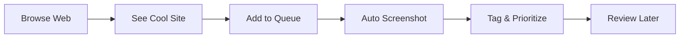

# Inspiration Queue Guide

## Overview

The inspiration queue allows you to bookmark websites for future cloning/study without immediately processing them. This creates a visual wishlist of designs you want to learn from when you have time.

## Adding Sites to Queue

### Quick Add via CLI

```bash
# Add a website to queue
npm run queue:add --url=https://example.com --name="Cool Site"

# Add with priority and notes
npm run queue:add \
  --url=https://example.com \
  --name="Amazing Portfolio" \
  --priority=high \
  --notes="Incredible scroll animations and typography"

# Add with tags
npm run queue:add \
  --url=https://example.com \
  --name="E-commerce Site" \
  --tags="minimal,clean,animations" \
  --industry="retail"
```

### Bookmarklet

Add this bookmarklet to quickly add sites while browsing:

```javascript
javascript:(function(){
  fetch('http://localhost:3000/api/queue/add', {
    method: 'POST',
    headers: {'Content-Type': 'application/json'},
    body: JSON.stringify({
      url: window.location.href,
      name: document.title,
      screenshot: true
    })
  }).then(() => alert('Added to Clibrary queue!'))
})();
```

### Browser Extension

Install the Clibrary browser extension to:
- Right-click to add sites to queue
- Capture screenshots automatically
- Add notes while browsing
- Set priority levels
- Tag sites immediately

## Queue Management

### Viewing Queue

```bash
# List all queued sites
npm run queue:list

# Filter by priority
npm run queue:list --priority=high

# Filter by tags
npm run queue:list --tags=animations

# Show stats
npm run queue:stats
```

### Queue Statuses

```typescript
type QueueStatus = 
  | 'queued'       // Just added, not reviewed
  | 'reviewed'     // Checked and tagged properly
  | 'planned'      // Scheduled for cloning
  | 'in-progress'  // Currently being cloned
  | 'complete'     // Fully processed
  | 'skipped'      // Decided not to clone
  | 'archived'     // Old queue items
```

### Prioritization

```json
{
  "priority": {
    "high": "Clone ASAP - amazing patterns to learn",
    "medium": "Interesting elements worth studying",
    "low": "Nice to have for reference"
  }
}
```

## Queue Interface

### Gallery View

The main library interface shows queued sites with:

```typescript
interface QueuedProject {
  // Visual Card
  thumbnail: string        // Screenshot or favicon
  livePreview: boolean    // Shows iframe of actual site
  status: 'queued'        // Visual badge
  
  // Metadata
  name: string
  originalUrl: string
  addedDate: Date
  priority: 'low' | 'medium' | 'high'
  
  // Notes
  notes: string           // What caught your attention
  elementsToStudy: string[] // Specific components/patterns
  
  // Quick Actions
  actions: {
    startCloning: () => void
    updatePriority: () => void
    addNotes: () => void
    archive: () => void
  }
}
```

### Preview Modes

```javascript
// 1. Live iframe (for queued sites)
<iframe src={project.originalUrl} />

// 2. Screenshot gallery
<ScreenshotGallery screenshots={project.screenshots} />

// 3. Split view (queued vs cloned)
<SplitView 
  original={project.originalUrl}
  cloned={project.clonedUrl}
/>
```

## Batch Processing

### Process Queue

```bash
# Start processing high priority items
npm run queue:process --priority=high

# Process specific number of items
npm run queue:process --count=5

# Process by tag
npm run queue:process --tag=ecommerce
```

### Automation

```javascript
// queue.config.js
{
  "automation": {
    "autoCapture": true,      // Capture screenshots on add
    "autoAnalyze": false,     // Run initial analysis
    "weeklyReview": true,     // Prompt to review queue
    "maxQueueSize": 100,      // Alert when queue gets large
    "staleAfterDays": 90      // Mark old items for review
  }
}
```

## Queue Workflows

### 1. Discovery Workflow



### 2. Weekly Review

```bash
# Review queue every Monday
npm run queue:review

# Shows:
# - New additions this week
# - High priority items
# - Stale items (>30 days)
# - Suggested batch to process
```

### 3. Sprint Planning

```bash
# Plan next cloning sprint
npm run queue:sprint

# Suggests 5-10 sites based on:
# - Priority
# - Time estimate
# - Skill learning goals
# - Variety (different styles/industries)
```

## Metadata Enhancement

### Auto-Enrichment

When adding to queue, automatically:

```javascript
{
  "autoEnrich": {
    "screenshot": true,         // Capture homepage
    "technologies": true,       // Detect tech stack
    "performance": true,        // Lighthouse scores
    "colors": true,            // Extract color palette
    "fonts": true,             // Detect fonts used
    "meta": true,              // Extract meta tags
    "socialPreview": true      // OG/Twitter cards
  }
}
```

### Manual Annotation

```bash
# Add notes to queued site
npm run queue:annotate site-id \
  --notes="Amazing card hover effects" \
  --components="card,button,nav" \
  --patterns="parallax,glassmorphism"

# Add reference images
npm run queue:attach site-id \
  --screenshots="./inspiration/cards.png"
```

## Queue Analytics

### Dashboard Metrics

```javascript
{
  "metrics": {
    "totalQueued": 47,
    "byPriority": {
      "high": 8,
      "medium": 15,
      "low": 24
    },
    "byAge": {
      "thisWeek": 5,
      "thisMonth": 12,
      "older": 30
    },
    "processingRate": "3 sites/week",
    "averageTimeInQueue": "18 days",
    "topTags": ["minimal", "animations", "typography"]
  }
}
```

### Insights

```bash
# Get queue insights
npm run queue:insights

# Shows patterns like:
# - Most queued industries
# - Common design styles
# - Processing velocity
# - Abandonment rate
```

## Integration with Main Library

### Status Indicators

```css
/* Visual badges for queue status */
.status-badge {
  &.queued { background: #gray; }
  &.planned { background: #blue; }
  &.in-progress { background: #yellow; }
  &.complete { background: #green; }
}
```

### Filtering

```javascript
// Filter gallery by status
const filters = {
  showQueued: true,
  showInProgress: true,
  showComplete: true
}

// Quick filters
<FilterBar>
  <Filter label="Inspiration Queue" status="queued" />
  <Filter label="Currently Cloning" status="in-progress" />
  <Filter label="Completed" status="complete" />
</FilterBar>
```

### Bulk Actions

```javascript
// Select multiple queued sites
<BulkActions>
  <Action onClick={startBatchCloning}>
    Start Cloning Selected
  </Action>
  <Action onClick={updatePriority}>
    Change Priority
  </Action>
  <Action onClick={addToSprint}>
    Add to Sprint
  </Action>
</BulkActions>
```

## API Endpoints

```typescript
// Queue management API
POST   /api/queue/add         // Add site to queue
GET    /api/queue             // List queued sites
PATCH  /api/queue/:id         // Update queue item
DELETE /api/queue/:id         // Remove from queue
POST   /api/queue/:id/process // Start processing
GET    /api/queue/stats       // Queue statistics
POST   /api/queue/bulk        // Bulk operations
```

## Chrome Extension Features

```javascript
// Extension popup when clicking icon
<PopupMenu>
  <QuickAdd url={currentTab.url} />
  <QueueCount count={47} />
  <RecentlyQueued items={last5} />
  <QuickLinks>
    <Link to="/queue">View Queue</Link>
    <Link to="/library">Open Library</Link>
  </QuickLinks>
</PopupMenu>

// Right-click context menu
chrome.contextMenus.create({
  title: "Add to Clibrary Queue",
  contexts: ["page", "link"],
  onclick: (info) => addToQueue(info.pageUrl || info.linkUrl)
})
```

## Best Practices

1. **Regular Reviews**: Review queue weekly to keep it manageable
2. **Clear Notes**: Write why you want to clone it while it's fresh
3. **Realistic Priorities**: Be honest about what you'll actually clone
4. **Batch Processing**: Process similar sites together
5. **Clean Up**: Archive or delete sites you'll never clone
6. **Tag Immediately**: Add tags when adding to queue
7. **Screenshot Key Pages**: Not just homepage

## Example Queue Entry

```json
{
  "id": "queue-001",
  "name": "Linear.app",
  "originalUrl": "https://linear.app",
  "status": "queued",
  "priority": "high",
  "addedDate": "2024-01-15T10:30:00Z",
  "notes": "Incredible micro-interactions, command palette, and keyboard navigation",
  "elementsToStudy": [
    "Command palette (cmd+k)",
    "Keyboard shortcuts system",
    "Smooth transitions between views",
    "Issue card hover states",
    "Dark mode implementation"
  ],
  "tags": ["saas", "productivity", "minimal", "animations"],
  "industry": "productivity",
  "designStyle": "minimal",
  "screenshots": [
    "screenshots/linear-home.png",
    "screenshots/linear-issues.png",
    "screenshots/linear-cmd-palette.png"
  ],
  "metadata": {
    "techStack": ["Next.js", "React", "TypeScript"],
    "colors": ["#5E6AD2", "#F7F8F8", "#1F2937"],
    "fonts": ["Inter", "SF Mono"],
    "performance": {
      "lighthouse": 95,
      "fcp": "0.8s",
      "lcp": "1.2s"
    }
  }
}
```